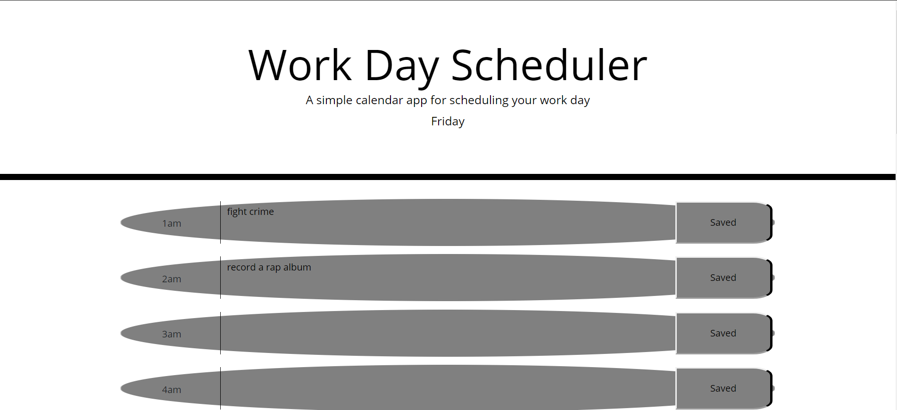
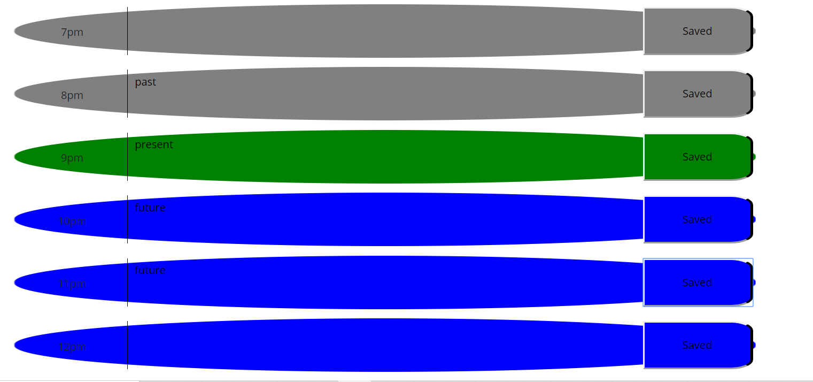

# work-day-planner

[Link to the launched application](https://antonio36alv.github.io/work-day-planner/)

[Link to the Repository](https://github.com/antonio36alv/work-day-planner)

## Project Description
With the provided starter code, my task was to implement a day planner through javascript. There is a timeblock div for every hour of the day, all generated through javascript. Each displays the hour of the day it represents, has a textbox for any kind of event loggings, and a save button. Event logs are saved into local storage for each hour that has notes in it. The event logs are saved as they are shown. If a user decides to erase all the event logs for an hour it will appear that way after a refresh. The current day is displayed at the top. The timeblock for the current hour is colored green, hours before are in gray, and hours yet to come are in blue.

### Link video here
-----------------------------

[Video Demo](https://drive.google.com/file/d/144VU3y0IJDJGCy0RYA9iZ6y7PVZLJqkl/view)